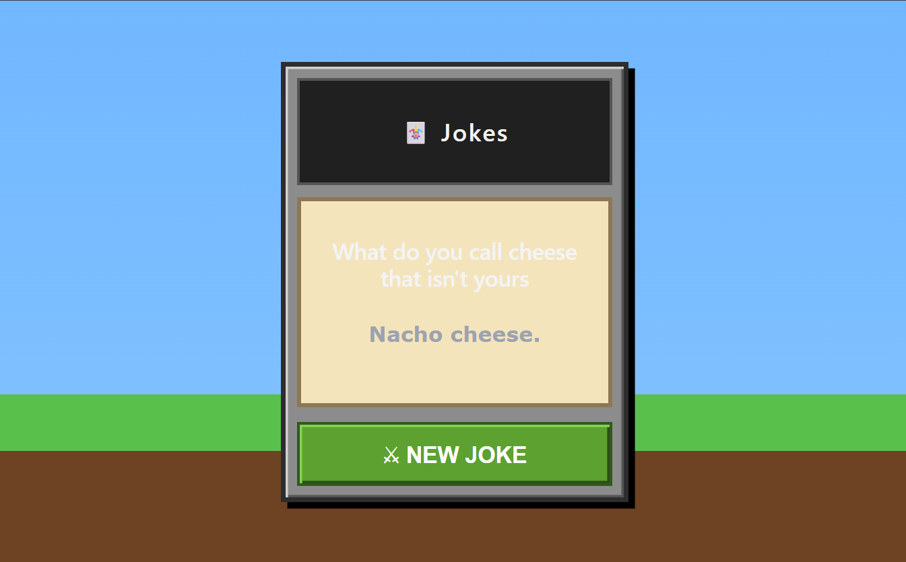

# Random Joke Generator


Random Joke Generator is a simple full-stack application built to understand how a React frontend communicates with an Express backend through REST APIs. The application fetches a random joke from the backend and displays it in a clean, user-friendly interface without requiring a page refresh.

## Features

* **Random Joke Generator:** Fetches a new random joke every time the user clicks the **New Joke** button.
* **REST API Communication:** Demonstrates communication between a React frontend and an Express backend using Axios.
* **Dynamic UI Updates:** Updates the joke instantly without reloading the page.
* **Simple Backend API:** Express serves random jokes from a predefined collection.
* **Beginner-Friendly Architecture:** Designed to understand the fundamentals of frontend-backend integration.

## System Architecture

This project follows a simple client-server architecture:

1. **React Client:** Sends a request to the Express API using Axios.
2. **Express Server:** Receives the request and selects a random joke.
3. **Response:** The selected joke is returned as JSON.
4. **React UI:** Displays the joke by updating the component state.

## Tech Stack

* **Frontend:** React.js, Vite, Axios
* **Backend:** Node.js, Express.js
* **Communication:** REST API (HTTP)

---

## App Screenshots

### Home Screen



---

## Getting Started

### Prerequisites

Make sure you have the following installed:

* Node.js (v18 or later)
* npm

### Installation

1. **Clone the repository**

```bash
git clone https://github.com/aashish-tharu/random-joke-generator.git
cd random-joke-generator
```

2. **Install Backend Dependencies**

```bash
cd backend
npm install
```

3. **Install Frontend Dependencies**

```bash
cd ../frontend
npm install
```

### Running the Application

**1. Start the Backend**

```bash
cd backend
npm start or node index
```

The backend runs on:

```
http://localhost:3000
```

**2. Start the Frontend**

```bash
cd frontend
npm run dev
```

The frontend runs on:

```
http://localhost:5173
```

---

## API Endpoint

### GET /api/getJokes

Returns a randomly selected joke from the server.

Example Response

```json
{
  "id": 4,
  "joke": "Why don't skeletons fight each other? They don't have the guts."
}
```

---

## What I Learned

Building this project helped me understand the fundamentals of full-stack web development. I learned how React communicates with an Express backend using REST APIs, how to use Axios for HTTP requests, how state updates dynamically without refreshing the page, and how frontend and backend applications work together during development using a proxy configuration.

---

*Designed and built by **Aashish Tharu***
